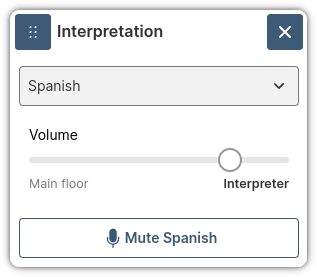

# Web App 3 Plugin: Interpretation

This plugin replicates the behavior of the
[Web App 2 plugin](https://github.com/pexip/plugin-interpretation-webapp2) for
interpretation, but it uses the new Web App 3 plugin system and the React
components.

This plugin should be deployed in the **same domain** as Web App 3 and for this
reason we have some additional steps to test it in a local environment.

In the plugin we have two roles that have to be deployed through brandings:

- **Interpreter:** User that translate what the people is saying in the main
  room.
- **Listener:** User that can join to the interpretation room and listen to what
  the interpreter is saying.

We have two additional brandings in case of a **bidirectional** scenario. This
scenario is when the the interpreter can translate from the main room to the
interpretation room and the other way around.

## Known limitations

- iOS devices have limitations when trying to change the volume of the main room
  and the interpretation room separately. For this reason, the slider to balance
  both audios will mute/unmute the main and interpretation rooms instead of
  changing the volume.

## How to use

The interface and the plugin capabilities will depend in its configuration.
Specially if the user is a **interpreter** or a **listener**, but there is a

- The user will start the interepretaion by pushing the interpretation button:

  <div align='center'>

  

  </div>

- The next step is to choose the language to which we want to translate to
  (interpreter) or get the translation (listener):

<div align='center'>


</div>

- Once the user is connected, they will see a different interface depending on
  the role:
  - The **interpreter** will see a dialog with the following buttons:
    - Drag and drop on the top-left corner.
    - Minimize in the top-right corner.
    - Close interpretation in the top-right corner.
    - Change language in the selector displaying the current language.
    - Invert translation (button with two arrows) that can reverse the
      translation and instead of translating from the "Main floor" > "Language",
      translate from "Language" > "Main floor".
    - Mute microphone on the bottom.

  <div align='center'>

  

  </div>
  - The **listener** will have a different interface:
    - Drag and drop on the top-left corner.
    - Minimize in the top-right corner.
    - Close interpretation in the top-right corner.
    - Change language in the selector displaying the current language.
    - Slider to balance the mix between the main floor and the interpreter.
    - Mute microphone on the bottom.

  <div align='center'>

  

  </div>

## Configure the plugin

The plugin has a config file (`config.json`) that drives how the plugin behaves.

Here is an example of configuration:

```json
{
  "role": "interpreter",
  "reusePin": true,
  "interpreter": {
    "allowChangeDirection": false
  },
  "listener": {
    "mainFloorVolume": 0.2,
    "speakToInterpretationRoom": false
  },
  "languages": [
    {
      "code": "0033",
      "name": "french"
    },
    {
      "code": "0034",
      "name": "spanish"
    }
  ]
}
```

| Parameter                          | type                           | Description                                                                                                                                                                                                                                                                                                                                                                                            |
| ---------------------------------- | ------------------------------ | ------------------------------------------------------------------------------------------------------------------------------------------------------------------------------------------------------------------------------------------------------------------------------------------------------------------------------------------------------------------------------------------------------ |
| role                               | 'interpreter' \| 'listener'    | Indicates the role of the user that joins to the interpretation. We have two different roles: `interpreter` and `listener`.                                                                                                                                                                                                                                                                            |
| reusePin                           | boolean                        | If `true` the application will reuse the pin of the main floor to the interpretation room. The only requirement is that the PIN should be included in the URL. It isn't supported if the user introduce the PIN manually.                                                                                                                                                                              |
| interpreter.allowChangeDirection   | boolean                        | If `true` the interpreter will be able to change the direction. He will be able to translate from the main floor to the interpretation room and the other way around. He will also be able to listen to the interpretation room.                                                                                                                                                                       |
| listener.mainFloorVolume           | number                         | Float value between 0 and 1 that indicates the percentage of the main floor that the `listener` will hear when he is connected to the interpretation room. The user will be able to change this manually.                                                                                                                                                                                              |
| listener.speakToInterpretationRoom | boolean                        | If enable, the listener will talk to the interpretation room instead of the main room.                                                                                                                                                                                                                                                                                                                 |
| languages                          | {code: string, name: string}[] | The list of all the available languages. Each language will have two values: `code` and `name`. The `code` is the suffix that will be attached to the conference name. For example, if for the main conference we have `conferenceAlias=123` and `code=0033`, the system will create a new audio conference with `conferenceAlias=1230033`. The `name` is used for the UI elements, such as selectors. |

The parameter `allowChangeDirection` needs an additional explanation. With this
parameter enabled, the interpreter can translate in both direction; from the
main room to the interpretation room and the other way around. Here is a
description of the behavior when the interpreter and listener are connected to
the interpretation:

- `interpreter.allowChangeDirection = false && listener.speakToInterpretationRoom = false`:
  In this case the interpreter only can translate from the main room to a
  interpretation room. Here are some details about each role:

  | Device  | Role        | Main Room | Interpretation Room |
  | ------- | ----------- | --------- | ------------------- |
  | Mic     | Interpreter | ❌        | ✅                  |
  | Mic     | Listener    | ✅        | ❌                  |
  | Speaker | Interpreter | 100%      | 100 %               |
  | Speaker | Listener    | ~10%      | ~90%                |

  **Note:** The interpreter also have 100% volume in the Interpretation Room to
  detect if another interpreter joins to the same channel. In other case, both
  interpreters will start translating at the same time without being aware of
  the other.

- `interpreter.allowChangeDirection = true && listener.speakToInterpretationRoom = true`:
  In this case the interpreter can change the direction of the translation. He
  can translate from the Main Room to the Interpretation Room and the other way
  around. In this case we have two other behavior based on the direction:
  - **Main Room -> Interpretation Room:**

    | Direction | Role        | Main Room | Interpretation Room |
    | --------- | ----------- | --------- | ------------------- |
    | Mic       | Interpreter | ❌        | ✅                  |
    | Mic       | Listener    | ❌        | ✅                  |
    | Speaker   | Interpreter | 100%      | 100%                |
    | Speaker   | Listener    | ~10%      | ~90%                |

    **Notes:** The interpreter will listen both channels at the same time. The
    listener can only talk to the interpreter. The people of the Main Room won't
    listen to the listener directly ever.

  - **Interpretation Room -> Main Room:**

    | Direction | Role        | Main Room | Interpretation Room |
    | --------- | ----------- | --------- | ------------------- |
    | Mic       | Interpreter | ✅        | ❌                  |
    | Mic       | Listener    | ❌        | ✅                  |
    | Speaker   | Interpreter | 100%      | 100%                |
    | Speaker   | Listener    | ~10%      | ~90%                |

    **Notes:** Now the interpreter will talk to the main room and the listener
    can still follow the conversation (~10% volume).

In both cases, if the interpreter leaves the interpretation room or if he is
muted, we put the volume of the main room to 100% for the listener and we
disable the slider.

### Configuration requirements starting from Infinity v37

The `id` of the plugin in the manifest should be `interpretation` to support the
new Widget concept.

In addition, because of the tightened security in v37,
`"sandboxValues": ["allow-same-origin"]` needs to be added to the plugin config
in the manifest.

More information about the above change can be found here:
https://developer.pexip.com/docs/infinity/web/plugins/webapp-3/sandbox-security

Your manifest will now look something like the following.

```
{
  ...
  "plugins": [
    {
    	"id": "interpretation",
    	"src": "...",
      "sandboxValues": ["allow-same-origin"]
    }
  ]
}
```

## Configure local policy

An easy way to test the plugin is to use a local policy. In this case we
designed a local policy for testing. It will allow every VMR with 2 or 6 digits
and will use the pins `1234` for the hosts and `4321` for the guests.

The process is as follows:

- We will use a local participant policy that adds a `callTag` to the
  participant in the **main room**. To obtain it, we will follow this process:
  1. Concatenate the following parameters:
     - `secret` (a secret value that we can change to invalidate all the
       generated `callTags`)
     - `local_alias`
     - `vendor`
     - `display_name`
  2. Apply `pex_hash` to the concatenated string.
  3. Take only the last 20 digits of the result.

- The plugin will retrieve the user's `callTag` and use it to generate the `pin`
  for the **interpretation room**. To do so, we will follow this process:
  1. Concatenate the following parameters:
     - The previous `callTag`
     - `role` (e.g., `interpreter` or `listener`)

- The service configuration policy will attempt to replicate the same `pin`
  using the same process. It will choose the role `interpreter` for the `pin`
  and `listener` for the `guest_pin`.


### Service configuration policy

```python
{# Static PINs but we can define a function to generate a PIN per VMR #}



{# Changing this value will invalidate all the generated callTags. #}
{# It should be the same used in the participant policy #}





  {# Main rooms for 2-digit VMRs #}

  {
    "action": "continue",
    "result": {
      "service_type": "conference",
      "name": "{{call_info.local_alias}}",
      "service_tag": "pexip-interpreter",
      "pin": "{{pin}}",
      "guest_pin": "{{guest_pin}}",
      "guests_can_present": true,
      "allow_guests": true,
      "view": "four_mains_zero_pips"
    }
  }


  {# Interpretation rooms for 6-digit VMRs #}

  

  
  

  {
    "action": "continue",
    "result": {
      "service_type": "conference",
      "name": "{{call_info.local_alias}}",
      "service_tag": "pexip-interpreter",
      "pin": "{{pin}}",
      "guest_pin": "{{guest_pin}}",
      "allow_guests": true
    }
  }



  {
    "action" : "continue",
    "result" : {{service_config | pex_to_json}}
  }



  {
    "action" : "reject",
    "result" : {}
  }


```

### Participant policy

```python
{# Changing this value will invalidate all the generated callTags. #}
{# It should be the same used in the participant policy #}




{# Remove the Webapp3 suffix from the vendor string, e.g. " Webapp3/11.0.0+c29a9d064" #}



  

  {
    "status": "success",
    "action": "continue",
    "result": {
      "call_tag": "{{callTag}}"
    }
  }



  {
    "status": "success",
    "action": "continue",
    "result": {}
  }


```

#### Security considerations

Although the system is secure and nobody can access an interpretation room
without being invited, we need to consider one aspect which will be addressed or
mitigated in future versions:

- When joining an interpretation room, an `interpreter` is assigned the `host`
  role, while a `listener` is assigned the `guest` role. This means that the
  meeting starts as soon as the first interpreter joins. Since the role
  assignment is based on a tag, a listener could potentially join to an
  interpretation room as host a instead of guest. This could allow the user to
  start the interpretation room and interact with the interpretation session via
  the API.

### Join with a SIP device to a interpretation room (testing only)

To join to an interpretation room through a SIP device you need to follow these
steps:

#### Create a new Call Routing Rule

- Click on `Services > Call Routing`.
- Click on `Add Call Routing Rule`.
- Define the following parameters (leave the rest as default):
  - **Name:** Interpretation SIP Join
  - **Priority:** 1
  - **Destination alias regex match** .\*
- Click on `Save`.

#### Create a VMR for interpretation

- Click on `Services > Virtual Meeting Rooms`.
- Click on `Add Virtual Meeting Room`.
- Define the following parameters (leave the rest as default):
  - **Name:** French room for 01
  - **Host PIN:** 5678
  - **Allow Guests:** true
  - **Guest PIN:** 8765
  - **Alias:** 010033
  - **Advanced options**:
    - **Guest can present:** false
    - **Enable chat:** false
    - **Conference capabilities:** Audio-only
- Click on `Save`.

#### Install a SIP softphone in your computer

- You need to install a SIP softphone in your computer. You can use
  [Zoiper](https://www.zoiper.com/en/voip-softphone/download/current) or any
  other softphone that you like.

- Configure the SIP softphone with a SIP account that can reach your Infinity
  deployment.

- Make a call to the VMR created in the previous step (e.g.
  010033@192.168.1.101). Use the dialpad to enter the PIN for the host or guest.

- In this case we will use the static VMR created before, so the host PIN is
  `5678` and the guest PIN is `8765`. The reason is that the `local_alias` is
  `sip:010033` and it doesn't match the regex for 2 or 6 digit VMRs from the
  local policy.

## Limit the number of languages

By default, the plugin will show all the languages defined in the configuration
file, but we can limit them per VMR. To do so, we can use the `description`
field of the Virtual Meeting Room configuration to define the subset of
languages that will be available for a specific VMR.

The languages should be defined in the `description` field separated by commas.
For example, if we want to show only Spanish and English, we can add the
following value in the `description` field:

<div align='center'>
  


</div>

### Participant policy

Now we will add a `description` to the `callTag` with the languages that we want
to show in the plugin. For example, if we want to show only Spanish and English,
we can add the following code in the participant policy:

```python
  {# Read the available languages from the VMR description and add them as suffix to the callTag. #}
  {# e.g. description: Spanish, English #}
  
    
  
```

This local policy will generate a `callTag` with the following format:
`01234567890123456789?spanish,english`.

## Build for production

To create a package you need to install first all the dependencies:

```bash
$ npm i
```

And now to create the package itself:

```bash
$ npm run build
```

Congrats! Your package is ready and it will be available in the `dist` folder.

## Run for development

Once the branding is deployed we need to configure some parameters:

- Edit `vite.json` with your environment parameters. You only have to modify the
  `infinityUrl` parameter with the URL of your Infinity deployment:

```json
{
  "infinityUrl": "https://192.168.1.101",
  ...
}
```

- Install all the dependencies:

```bash
$ npm i
```

- Run the dev environment:

```bash
$ npm run interpreter
```

or

```bash
$ npm run listener
```
